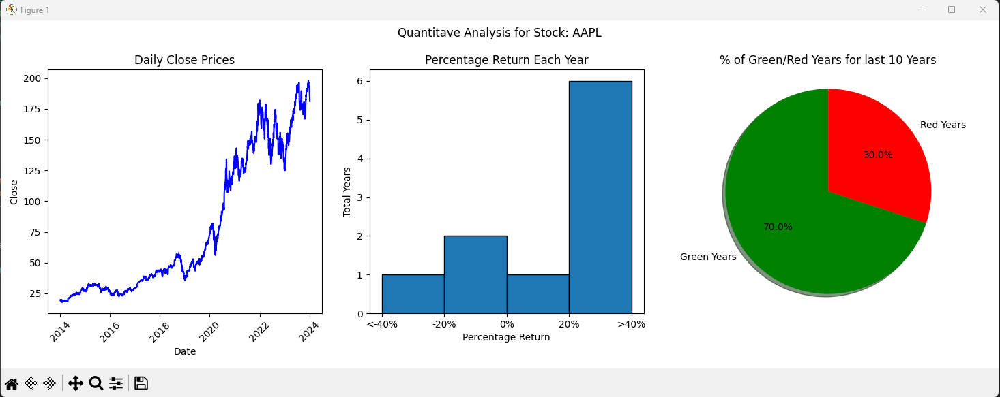
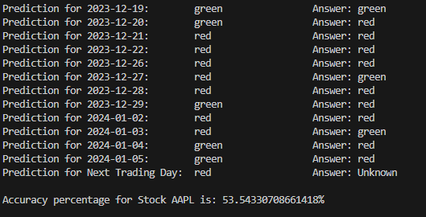

# Stock Market Prediction Model

The Stock Market Prediction Model is an application that offers quantitative analysis of all US stocks. Utilizing data from the Yahoo Finance API, it provides a comprehensive toolset for stock market enthusiasts and traders. The application operates without the need to store data locally, ensuring efficiency and up-to-date information.


## Features

- **Data-Driven Insights:** Runs on the cloud or a local machine for convenient investing.
- **Quantitative Analysis:** Provides detailed statistics on the selected stock, including key financial metrics and performance indicators.
- **Visualizations:** Runs on the cloud or a local machine for convenient investing.
- **Machine Learning Predictions:** Runs on the cloud or a local machine for convenient investing.
- **Automatic Retraining:** Runs on the cloud or a local machine for convenient investing.
- **User-Friendly Command Line Interface:** Designed with simplicity in mind, the application's command line interface is straightforward and easy to navigate.


## Examples


- **Quantitative Analysis using statistics for AAPL:** 


- **Visualizations for AAPL:** 


- **Prediction for green/red close AAPL (Automatically updates every day):** 



## Getting Started
To set up Stock Market Prediciton Model, follow these steps:

1. **Clone the Repository:**
   ```bash
   git clone https://github.com/arunrai3/StockMarketPredicitionModel.git

2. **Navigate to the Repository Directory:**
   ```bash
   cd StockMarketPredicitionModel

3. **Install Dependencies:**
   Run the following command from root directory to install the necessary dependencies:
   ```bash
   pip install -r requirements.txt


4. **Run the Bot:**
   Execute the main script:
   ```bash
   python src/main.py

## Future Enhancements 

- **Web Hosting:** Plans to host this application on the web for easier and broader accessibility.
- **Expanded Prediction Timeframes:** Introducing predictions for longer timeframes, such as one week and one month, to cater to both short-term traders and long-term investors.


## Risk Disclosure

**Please Note:** StockMarketPredictionModel is a tool intended solely for educational purposes. Users should be aware that investing in the stock market involves a degree of risk, and potential investors should do their own research or consult with a financial advisor before making any investment decisions. Not only does the stock market have risk, but so do algorithms like this one that are used to make trades. Please be aware of bugs and tailor your risk tolerance based on possiblity of computer errors. The creators and contributors of StockMarketPredictionModel are not responsible for any financial losses that may result from using this tool. By using StockMarketPredictionModel, you acknowledge and agree that you are solely responsible for your investment decisions and any resulting gains or losses.
