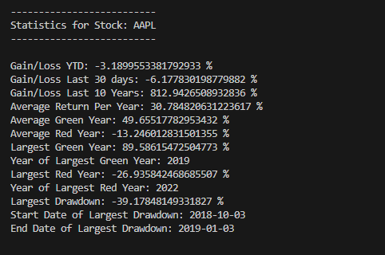

# Stock Market Prediction Model


## Features


## Examples




## Getting Started
To set up Stock Market Prediciton Model, follow these steps:

1. **Clone the Repository:**
   ```bash
   git clone https://github.com/arunrai3/StockMarketPredicitionModel.git

2. **Navigate to the Repository Directory:**
   ```bash
   cd StockMarketPredicitionModel

3. **Install Dependencies:**
   Run the following command from root directory to install the necessary dependencies:
   ```bash
   pip install -r requirements.txt


4. **Run the Bot:**
   Execute the main script:
   ```bash
   python src/main.py


## Risk Disclosure

**Please Note:** StockMarketPredictionModel is a tool intended solely for educational purposes. Users should be aware that investing in the stock market involves a degree of risk, and potential investors should do their own research or consult with a financial advisor before making any investment decisions. Not only does the stock market have risk, but so do algorithms like this one that are used to make trades. Please be aware of bugs and tailor your risk tolerance based on possiblity of computer errors. The creators and contributors of StockMarketPredictionModel are not responsible for any financial losses that may result from using this tool. By using StockMarketPredictionModel, you acknowledge and agree that you are solely responsible for your investment decisions and any resulting gains or losses.
